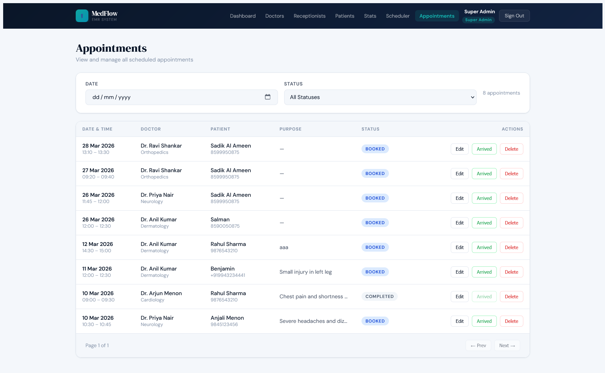

# 🏥 MedFlow — Hospital EMR & Appointment System

[](https://your-live-url.vercel.app)
[](https://your-api.onrender.com)
[](https://github.com/)
[](LICENSE)

> A production-ready full-stack hospital EMR system with patient portal, Razorpay payments, OTP verification, real-time slot booking, analytics dashboard, and role-based access for Admin, Doctor, Receptionist, and Patient.

---

## 📸 Screenshots

### Admin

#### Admin Dashboard
.png)

#### System Statistics


#### Manage Doctors


#### Manage Receptionists


#### Manage Patients


### Receptionist

#### Scheduler / Slot Grid


#### Appointments


### Patient Portal

#### Patient Portal Login


#### Patient Booking (slot selected)


#### Razorpay Payment


#### Patient Appointments


### Responsive

#### Mobile View


---

## ✨ Features

| Group | Feature | Details |
|-------|---------|---------|
| **Core EMR** | JWT Authentication | Access token (15 min) + refresh token (7 days, HTTP-only cookie) |
| **Core EMR** | Role-Based Access Control | `SUPER_ADMIN`, `DOCTOR`, `RECEPTIONIST`, `PATIENT` |
| **Core EMR** | Dynamic slot generation | Working hours, break times, slot duration per doctor |
| **Core EMR** | Double-booking prevention | MongoDB unique compound index on `doctorId` + date + `slotStartTime` |
| **Core EMR** | Doctor management | Create, edit, delete with login account (MongoDB transaction) |
| **Core EMR** | Receptionist management | Full CRUD by Super Admin |
| **Core EMR** | Department management | MongoDB-backed, 13 defaults seeded, add/remove custom |
| **Patient Portal** | Self-registration | Email OTP verification (Nodemailer) |
| **Patient Portal** | Patient login | JWT auth (same system, `PATIENT` role) |
| **Patient Portal** | Forgot password | OTP-based reset flow |
| **Patient Portal** | Change password | From profile settings |
| **Patient Portal** | Login security | Alert email on every login |
| **Patient Portal** | Patient profile | Name, age, gender, blood group, phone, address, medical history |
| **Patient Portal** | Profile photo | Multer + Cloudinary (face-crop, 400×400, 2 MB limit) |
| **Patient Portal** | Default avatar | ui-avatars.com when no photo uploaded |
| **Patient Portal** | Real-time booking | Same slot grid as receptionist, 30-second polling |
| **Patient Portal** | Razorpay payment | ₹1 booking fee before slot is confirmed |
| **Patient Portal** | Payment verification | HMAC SHA256 signature on backend |
| **Patient Portal** | Emails | Booking confirmation + cancellation emails |
| **Patient Portal** | History | Appointment list with payment status |
| **Admin** | Manage Patients | View all patients, photos, verified status, appointment count, delete |
| **Admin** | Revenue dashboard | Total revenue, today, month, paid bookings, failed/pending counts |
| **Admin** | Recent paid bookings | Patient, doctor, date, time, amount, payment ID |
| **Admin** | Charts | Appointments this week (bar), by department (pie) — Recharts |
| **Admin** | Export reports | PDF + Excel (jsPDF + SheetJS) |
| **Admin** | System statistics | Totals for doctors, receptionists, patients, appointments |
| **UX & Quality** | Notifications | React-Toastify on actions across all roles |
| **UX & Quality** | Responsive UI | Mobile-first — cards on small screens, tables on desktop |
| **UX & Quality** | Patient exports | PDF or Excel for own appointments |
| **UX & Quality** | SPA routing | Vercel rewrites (`vercel.json`) — no 404 on refresh |

---

## 🛠 Tech Stack

| Layer | Technology |
|-------|-----------|
| Frontend | React 18, Vite, Tailwind CSS, CSS Variables |
| Backend | Node.js 20, Express 5, Mongoose |
| Database | MongoDB Atlas |
| Auth | JWT (jsonwebtoken), bcryptjs |
| Email | Nodemailer + Gmail App Password |
| OTP | bcrypt-hashed, TTL-indexed MongoDB collection |
| File Upload | Multer + Cloudinary (multer-storage-cloudinary) |
| Payment | Razorpay (test mode, ₹1 booking fee) |
| Charts | Recharts (BarChart + PieChart) |
| Export | jsPDF + jspdf-autotable + SheetJS (xlsx) |
| Notifications | React-Toastify |
| Security | Helmet, express-rate-limit, CORS |
| Containerisation | Docker, Docker Compose, Nginx |
| Deployment | Vercel (frontend) + Render (backend) + MongoDB Atlas |

---

## 🏗 Architecture

```
┌─────────────────────────────────────┐
│   React + Vite (Vercel)             │
│   Admin · Doctor · Receptionist     │
│   Patient Portal · Razorpay UI      │
└────────────┬────────────────────────┘
             │ HTTP / REST + Axios
┌────────────▼────────────────────────┐
│   Express API (Render)              │
│   JWT Auth → RBAC Middleware        │
│   → Controllers → Services          │
│   Nodemailer · Razorpay · Cloudinary│
└────────────┬────────────────────────┘
             │ Mongoose ODM
┌────────────▼────────────────────────┐
│   MongoDB Atlas                     │
│   users · doctors · patients        │
│   appointments · payments · otps    │
│   departments · receptionists       │
└─────────────────────────────────────┘
```

---

## 📁 Project Structure

```
MERN-EMR-APP/
├── docker-compose.yml
├── README.md
│
├── Server/
│   ├── Dockerfile
│   ├── server.js
│   ├── env.js
│   ├── .env.example
│   ├── config/
│   │   ├── db.js
│   │   ├── mailer.js
│   │   ├── emailTemplates.js
│   │   └── cloudinary.js
│   ├── controllers/
│   │   ├── authController.js
│   │   ├── doctorController.js
│   │   ├── patientController.js
│   │   ├── patientAuthController.js
│   │   ├── patientPortalController.js
│   │   ├── patientAppointmentController.js
│   │   ├── patientAdminController.js
│   │   ├── appointmentController.js
│   │   ├── adminController.js
│   │   ├── userController.js
│   │   ├── departmentController.js
│   │   ├── paymentController.js
│   │   └── revenueController.js
│   ├── middleware/
│   │   ├── authMiddleware.js
│   │   ├── roleMiddleware.js
│   │   ├── errorMiddleware.js
│   │   └── validateMiddleware.js
│   ├── models/
│   │   ├── User.js
│   │   ├── Doctor.js
│   │   ├── Patient.js
│   │   ├── Appointment.js
│   │   ├── Receptionist.js
│   │   ├── Log.js
│   │   ├── OTP.js
│   │   ├── Payment.js
│   │   └── Department.js
│   ├── routes/
│   │   ├── authRoutes.js
│   │   ├── doctorRoutes.js
│   │   ├── patientRoutes.js
│   │   ├── patientAuthRoutes.js
│   │   ├── patientPortalRoutes.js
│   │   ├── appointmentRoutes.js
│   │   ├── slotRoutes.js
│   │   ├── adminRoutes.js
│   │   ├── patientAdminRoutes.js
│   │   ├── departmentRoutes.js
│   │   ├── paymentRoutes.js
│   │   └── revenueRoutes.js
│   ├── services/
│   │   ├── slotService.js
│   │   └── logService.js
│   ├── utils/
│   │   ├── slotGenerator.js
│   │   ├── tokenUtils.js
│   │   ├── createAdmin.js
│   │   └── createPatient.js
│   └── validations/
│       └── appointmentValidation.js
│
└── Client/
    ├── Dockerfile
    ├── nginx.conf
    ├── vercel.json
    ├── .env.example
    └── src/
        ├── App.jsx
        ├── main.jsx
        ├── components/
        │   ├── Navbar.jsx
        │   ├── ProtectedRoute.jsx
        │   ├── PatientRoute.jsx
        │   ├── RoleRoute.jsx
        │   ├── SlotGrid.jsx
        │   ├── AppointmentForm.jsx
        │   ├── Loader.jsx
        │   └── ErrorMessage.jsx
        ├── context/
        │   └── AuthContext.jsx
        ├── hooks/
        │   ├── useAppointments.js
        │   └── useDoctors.js
        ├── pages/
        │   ├── LoginPage.jsx
        │   ├── AdminDashboard.jsx
        │   ├── DoctorDashboard.jsx
        │   ├── ReceptionistDashboard.jsx
        │   ├── SchedulerPage.jsx
        │   ├── BookingPage.jsx
        │   ├── AppointmentListPage.jsx
        │   ├── patient/
        │   │   ├── PatientLoginPage.jsx
        │   │   ├── PatientRegisterPage.jsx
        │   │   ├── PatientOTPPage.jsx
        │   │   ├── PatientForgotPasswordPage.jsx
        │   │   ├── PatientDashboardPage.jsx
        │   │   ├── PatientProfilePage.jsx
        │   │   ├── PatientBookPage.jsx
        │   │   └── PatientAppointmentsPage.jsx
        │   └── admin/
        │       ├── DoctorsPage.jsx
        │       ├── ReceptionistsPage.jsx
        │       ├── SystemStatsPage.jsx
        │       └── PatientsPage.jsx
        ├── routes/
        │   └── AppRoutes.jsx
        ├── services/
        │   └── api.js
        └── utils/
            ├── formatTime.js
            ├── toast.js
            └── exportUtils.js
```

---

## ⚙️ Setup & Installation

### Prerequisites

- Node.js ≥ 18 (Node 20 recommended)
- MongoDB Atlas URI (or Docker for local MongoDB)

### 1. Clone the repository

```bash
git clone <your-repo-url>
cd MERN-EMR-APP
```

### 2. Backend

```bash
cd Server
npm install
cp .env.example .env   # fill in your values (see below)
npm run seed:admin     # create Super Admin (run once)
npm run dev            # http://localhost:5000
```

### 3. Frontend

```bash
cd Client
npm install
cp .env.example .env
npm run dev            # http://localhost:5173
```

### Environment variables

#### `Server/.env` (complete list)

```env
PORT=5000
MONGO_URI=mongodb+srv://...
JWT_ACCESS_SECRET=your_64_char_secret
JWT_REFRESH_SECRET=your_different_64_char_secret
NODE_ENV=development
CLIENT_ORIGIN=http://localhost:5173
EMAIL_USER=your_gmail@gmail.com
EMAIL_PASS=your_gmail_app_password
CLOUDINARY_CLOUD_NAME=your_cloud_name
CLOUDINARY_API_KEY=your_api_key
CLOUDINARY_API_SECRET=your_api_secret
RAZORPAY_KEY_ID=your_razorpay_key_id
RAZORPAY_KEY_SECRET=your_razorpay_key_secret
```

#### `Client/.env`

```env
VITE_API_URL=http://localhost:5000
VITE_RAZORPAY_KEY_ID=your_razorpay_key_id
```

---

## 🔑 Default Credentials

```
Super Admin:    superadmin@emr.com   /  Admin@1234
Doctor:         arjun.menon@emr.com  /  Doctor@123
Receptionist:   sneha.thomas@emr.com /  Recept@123
Patient:        (self-register via Patient Portal)
```

---

## 📡 API Documentation

### Auth

| Method | Endpoint | Description | Auth |
|--------|----------|-------------|------|
| POST | `/api/auth/login` | Login → accessToken + refresh cookie | — |
| POST | `/api/auth/refresh` | New access token via refresh cookie | — |
| POST | `/api/auth/logout` | Clear refresh cookie | — |

### Doctors

| Method | Endpoint | Description | Roles |
|--------|----------|-------------|-------|
| GET | `/api/doctors` | List doctors (optional `?department=`) | Authenticated |
| POST | `/api/doctors` | Create doctor + user | SUPER_ADMIN |
| PUT | `/api/doctors/:id` | Update doctor schedule | SUPER_ADMIN |
| DELETE | `/api/doctors/:id` | Delete doctor + user | SUPER_ADMIN |

### Slots

| Method | Endpoint | Description | Roles |
|--------|----------|-------------|-------|
| GET | `/api/slots?doctorId=&date=` | Available / booked slots | Authenticated |

### Appointments (staff)

| Method | Endpoint | Description | Roles |
|--------|----------|-------------|-------|
| POST | `/api/appointments` | Book appointment | SUPER_ADMIN, RECEPTIONIST |
| GET | `/api/appointments` | List (role-filtered) | SUPER_ADMIN, DOCTOR, RECEPTIONIST |
| PUT | `/api/appointments/:id` | Edit purpose / notes / status | SUPER_ADMIN, RECEPTIONIST |
| DELETE | `/api/appointments/:id` | Delete | SUPER_ADMIN, RECEPTIONIST |
| POST | `/api/appointments/:id/arrive` | Mark arrived | SUPER_ADMIN, RECEPTIONIST |

### Patients (staff)

| Method | Endpoint | Description | Roles |
|--------|----------|-------------|-------|
| POST | `/api/patients` | Create patient | SUPER_ADMIN, RECEPTIONIST |
| GET | `/api/patients/search?query=` | Search by name / mobile / ID | SUPER_ADMIN, DOCTOR, RECEPTIONIST |

### Admin

| Method | Endpoint | Description | Roles |
|--------|----------|-------------|-------|
| GET | `/api/admin/receptionists` | List receptionists | SUPER_ADMIN |
| POST | `/api/admin/receptionists` | Create receptionist | SUPER_ADMIN |
| PUT | `/api/admin/receptionists/:id` | Update receptionist | SUPER_ADMIN |
| DELETE | `/api/admin/receptionists/:id` | Delete receptionist | SUPER_ADMIN |
| GET | `/api/admin/stats` | System statistics | SUPER_ADMIN |
| GET | `/api/admin/stats/by-department` | Appointments by department | SUPER_ADMIN |

#### Patient Auth

| Method | Endpoint | Description | Auth |
|--------|----------|-------------|------|
| POST | `/api/patient/auth/register` | Register + send OTP | — |
| POST | `/api/patient/auth/verify-otp` | Verify OTP → create account | — |
| POST | `/api/patient/auth/resend-otp` | Resend OTP (max 3/hr) | — |
| POST | `/api/patient/auth/login` | Patient login | — |
| POST | `/api/patient/auth/forgot-password` | Send reset OTP | — |
| POST | `/api/patient/auth/reset-password` | Reset with OTP token | — |
| POST | `/api/patient/auth/change-password` | Change while logged in | PATIENT |
| POST | `/api/patient/auth/logout` | Clear session | PATIENT |

#### Patient Profile

| Method | Endpoint | Description | Auth |
|--------|----------|-------------|------|
| GET | `/api/patient/profile` | Get own profile | PATIENT |
| PUT | `/api/patient/profile` | Update profile | PATIENT |
| POST | `/api/patient/profile/photo` | Upload profile photo | PATIENT |

#### Patient Appointments

| Method | Endpoint | Description | Auth |
|--------|----------|-------------|------|
| GET | `/api/appointments/available-slots` | Get available slots | PATIENT |
| POST | `/api/appointments/patient-book` | Book after payment | PATIENT |
| GET | `/api/appointments/my-appointments` | Own appointment history | PATIENT |
| DELETE | `/api/appointments/my-appointments/:id` | Cancel appointment | PATIENT |

#### Payment

| Method | Endpoint | Description | Auth |
|--------|----------|-------------|------|
| POST | `/api/payment/create-order` | Create Razorpay order | PATIENT |
| POST | `/api/payment/verify` | Verify + confirm booking | PATIENT |
| POST | `/api/payment/failed` | Mark payment failed | PATIENT |

#### Revenue (Admin)

| Method | Endpoint | Description | Auth |
|--------|----------|-------------|------|
| GET | `/api/admin/revenue/stats` | Revenue summary | SUPER_ADMIN |
| GET | `/api/admin/revenue/recent` | Recent paid bookings | SUPER_ADMIN |
| GET | `/api/admin/revenue/chart` | Weekly appointments data | SUPER_ADMIN |

#### Admin Patients

| Method | Endpoint | Description | Auth |
|--------|----------|-------------|------|
| GET | `/api/admin/patients` | All patients (paginated) | SUPER_ADMIN |
| GET | `/api/admin/patients/:id` | Patient detail + appointments | SUPER_ADMIN |
| DELETE | `/api/admin/patients/:id` | Delete patient + user | SUPER_ADMIN |

#### Departments

| Method | Endpoint | Description | Auth |
|--------|----------|-------------|------|
| GET | `/api/departments` | All departments | Authenticated |
| POST | `/api/departments` | Add department | SUPER_ADMIN |
| DELETE | `/api/departments/:id` | Remove department | SUPER_ADMIN |

---

## 🔐 Role Permissions

| Feature | Super Admin | Receptionist | Doctor | Patient |
|---------|:-----------:|:------------:|:------:|:-------:|
| Login | ✅ | ✅ | ✅ | ✅ |
| Manage Doctors | ✅ | — | — | — |
| Manage Receptionists | ✅ | — | — | — |
| Manage Patients | ✅ | — | — | — |
| Revenue Dashboard | ✅ | — | — | — |
| Export Reports | ✅ | — | — | — |
| Analytics Charts | ✅ | — | — | — |
| Scheduler (all doctors) | ✅ | ✅ | — | — |
| Book Appointment (free) | ✅ | ✅ | — | — |
| Book Appointment (paid) | — | — | — | ✅ |
| View All Appointments | ✅ | ✅ | — | — |
| View Own Appointments | ✅ | ✅ | ✅ | ✅ |
| Edit / Delete Appointment | ✅ | ✅ | — | — |
| Cancel Own Appointment | — | — | — | ✅ |
| Own Profile + Photo | — | — | — | ✅ |

---

## 💳 Payment Flow

```
Patient selects slot → "Book & Pay ₹1"
  → POST /api/payment/create-order (backend creates Razorpay order)
  → Razorpay popup opens (prefilled with patient details)
      ├── SUCCESS
      │     → POST /api/payment/verify
      │     → Backend: HMAC SHA256 signature verification
      │     → Appointment created in DB
      │     → Confirmation email sent
      │     → Toast: "Payment successful! Appointment confirmed 🎉"
      └── FAILED / Dismissed
            → POST /api/payment/failed
            → Slot remains available
            → Toast: "Payment failed. Please try again."
```

**Razorpay test card:** `4111 1111 1111 1111`, any future expiry, any CVV.

---

## 🕒 Slot Generation Logic

File: `Server/utils/slotGenerator.js`

```
Input:
  workingHoursStart: "09:00"
  workingHoursEnd:   "17:00"
  slotDuration:      30 minutes
  breakStart:        "13:00"
  breakEnd:          "14:00"

Output slots:
  09:00–09:30, 09:30–10:00, ..., 12:30–13:00
  [break excluded]
  14:00–14:30, ..., 16:30–17:00
```

Rules enforced:

- No overlapping slots
- Break window fully excluded
- Past slots marked as BOOKED (not selectable)
- Date picker has `min=today` to prevent past date selection

---

## 🔁 Concurrency & Double-Booking Prevention

The `Appointment` model uses a **MongoDB unique compound index**:

```js
appointmentSchema.index(
  { doctorId: 1, appointmentDate: 1, slotStartTime: 1 },
  { unique: true }
);
```

If two users simultaneously book the same slot, MongoDB throws `E11000 duplicate key error`. The backend catches error code `11000` and returns `409 Conflict`. This is atomic and requires no application-level locking.

---

## ⚡ Performance Optimizations

### Backend

- `Promise.all()` for parallel DB queries (appointments + count in one round trip)
- MongoDB indexes: `doctorId`, `appointmentDate`, `patientId`, `timestamp`
- Compound unique index on `doctorId + appointmentDate + slotStartTime`
- Pagination on list endpoints (`page`, `limit`)
- Role-based query filtering (doctors only see their own data)
- `select("-password")` to avoid loading sensitive fields unnecessarily

### Frontend

- `useCallback` and `useMemo` for stable references and derived data
- Custom hooks (`useAppointments`, `useDoctors`) to separate data logic from UI
- Axios interceptor for automatic token refresh — no per-component retry logic
- Department filtering computed client-side from loaded doctors (no extra API call)
- `min` attribute on date inputs to prevent invalid selections before API call

---

## 🛡 Security Measures

- **Helmet** — Sets secure HTTP headers
- **CORS** — Restricted to `CLIENT_ORIGIN` (with sensible dev fallbacks where configured)
- **Rate Limiting** — 100 requests / 15 min per IP on `/api/*`
- **JWT** — Short-lived access tokens (15 min), refresh tokens in HTTP-only cookie (JS-inaccessible)
- **bcrypt** — Password hashing with salt rounds = 10, via Mongoose pre-save hook
- **Joi** — Input validated and sanitized before DB operations where used
- **RBAC middleware** — Routes checked at middleware level, not only on the frontend
- **NoSQL injection** — Mitigated by Mongoose schema typing + validation

---

## 🐳 Docker Setup

Make sure Docker and Docker Compose are installed.

```bash
# From project root
cp Server/.env.example .env   # fill MONGO_URI, JWT secrets, etc.
docker-compose up --build
```

| Service | URL |
|---------|-----|
| Frontend | http://localhost:5173 |
| Backend API | http://localhost:3000 |
| MongoDB | localhost:27017 |

To seed the admin inside Docker:

```bash
docker exec -it emr-server node utils/createAdmin.js
```

---

## 🚀 Deployment

| Component | Platform | URL |
|-----------|----------|-----|
| Frontend | Vercel | your-app.vercel.app |
| Backend | Render | your-api.onrender.com |
| Database | MongoDB Atlas | cloud.mongodb.com |
| Media | Cloudinary | cloudinary.com |
| Payments | Razorpay | razorpay.com (test mode) |

> **Vercel SPA fix:** `Client/vercel.json` contains a rewrite rule that redirects all routes to `index.html`, preventing 404 on page refresh.

### Manual production build

```bash
# Backend
cd Server
NODE_ENV=production npm start

# Frontend
cd Client
npm run build
# serve /dist with your host (or Vercel)
```

```bash
docker-compose up -d --build
```

---

## 🎬 Demo

▶️ [Watch Demo Video](#) — *(2.5 min walkthrough — Admin dashboard, Patient portal, Razorpay payment, email confirmation, mobile view)*

---

Built by **Salman Rasheed M** — [LinkedIn](https://www.linkedin.com/in/salmanrasheedm) · [GitHub](https://github.com/salmanrasheedm)
